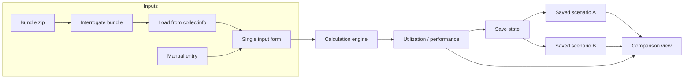

# Dynamic Aerospike Capacity Planning Tool – Design Plan

## Scope (current vs future)

- **Current plan:** Capacity planning for **one namespace** on **one cluster**. All inputs and outputs are for a single namespace and a single cluster (topology, devices, memory, workload, and resilience are cluster-wide; object count, record size, read/write mix, and SI are for that one namespace).
- **Future:** The tool should be extended to support **multiple namespaces in a cluster**. Design the data model and UI so that adding per-namespace inputs and aggregating or comparing namespaces later is feasible (e.g. one namespace per "use case" or section, with cluster-level topology shared).

## Multi-namespace computation (future phase)

When implementing multiple namespaces, the following computational changes apply. The UI mockup ([docs/mockups/mockup-cluster-namespace-split-with-definition.html](docs/mockups/mockup-cluster-namespace-split-with-definition.html)) already assumes multiple namespace cards; the engine and API need to support the corresponding input shape and aggregation.

- **Input shape:** Cluster-level params (nodes_per_cluster, devices_per_node, device_size_gb, available_memory_gb, overhead_pct, nodes_lost) plus a **list of namespace workload configs** (each with name, replication_factor, master_object_count, avg_record_size_bytes, read_pct, write_pct, tombstone_pct, si_count, si_entries_per_object).
- **Engine:** Run existing workload-derived formulas **per namespace**; then **aggregate**: sum data stored and total memory used across namespaces. Cluster utilization = aggregated totals ÷ cluster available (storage, memory). Failure scenario uses the same aggregation. See [docs/CALCULATION_CATALOG.md](docs/CALCULATION_CATALOG.md) Sizing Estimator Workload sheet (e.g. "Unique Data Size total = Sum of unique data across use cases" B54, "Minimum RAM/Disk = Sum across use cases" B62–B63).
- **API:** Request body includes cluster-level fields and `namespaces: [{ name, replication_factor, ... }, ...]`. Response keeps aggregated outputs (same as current CapacityOutputs); optionally add per-namespace breakdown later.
- **Ingest (Load from collectinfo):** Return cluster-level fields plus a **list of namespace workload dicts** (one per namespace row in asadm summary) so the UI can pre-fill multiple Namespace cards from one bundle.

## Current state (from workbooks)

- **Capacity_planner_v3.0-fidelity_workbench.xlsx** provides the formula source: [worksheetManual](Capacity_planner_v3.0-fidelity_workbench.xlsx) + [calcManual](Capacity_planner_v3.0-fidelity_workbench.xlsx) define inputs and calculations; [worksheetcollectinfo](Capacity_planner_v3.0-fidelity_workbench.xlsx) / [calccollectinfo](Capacity_planner_v3.0-fidelity_workbench.xlsx) show the same metrics when inputs come from a collectinfo file. The workbook's **Compare** tab side-by-sides two runs (e.g. `=calcManual!C85` vs `=calcManual!G85`); in the tool, comparison will be **saved state vs saved state** (or current), not "manual vs collectinfo" as separate modes.
- **Advanced settings** tab encodes storage thresholds (evict-used-pct, stop-writes-used-pct, etc.) and AllowedUsedFraction / RequiredStorageBytes logic; references a "background calculator."
- **Tool_Aerospike_Sizing_Estimator_(10_14).xlsx** adds workload/AWS/custom sizing (named ranges, VLOOKUPs, multi-namespace formulas) for future evolution.

The repo lives at **wmaddux/tam-capacitron** on GitHub. It currently contains only these two workbooks and a minimal README; no application code yet. **Collectinfo ingestion** is driven by a **single ingestor engine** shared by both tam-capacitron and **tam-flash-report** (citrusleaf/tam-tools): tam-flash-report uses it and writes to SQLite for its own downstream processing; tam-capacitron will use the **same ingestor** (e.g. as a dependency or by invoking it) and map the result (e.g. from the SQLite output or a shared schema) to the capacity engine input set. There is no separate collectinfo parser in tam-capacitron.

**Sample ingest for initial collectinfo testing:** [bundles/fidelity-case00044090-20250226.zip](bundles/fidelity-case00044090-20250226.zip). This file is a **bundle** (zip) that contains more than just collectinfo files (e.g. logs and other artifacts). The tool must be able to **interrogate and parse such bundles**: open the archive, list/inspect contents, identify collectinfo file(s), and feed the relevant parts to the ingestor. Design for extensibility: **logs will eventually be used** to help with capacity planning calculations (e.g. from the same bundle or separate uploads), so bundle parsing and artifact discovery should support adding log-based inputs later.

## Architecture

- **Single input form, single engine:** One set of inputs (replication factor, nodes, devices, memory, workload, etc.). User can type values or use **"Load from collectinfo"** to auto-fill from a **bundle** (zip) or a raw collectinfo file. Bundles contain multiple artifacts (collectinfo, logs, etc.); the tool must interrogate the bundle (list contents, find collectinfo), then run the **shared ingestor engine (tam-tools)** and apply the mapping to the form. After any adjustments, the same form drives the engine and shows utilization/performance.
- **Comparison = saved states:** User **saves state** (current inputs + resulting outputs, with an optional name/label). Later they can save another state (e.g. after tuning). **Comparison mode** shows two states side-by-side (or diff): e.g. "Baseline (from collectinfo)" vs "After adding nodes," or any saved scenario A vs scenario B (or vs current). This makes the tool effective for experimenting and comparing before/after or scenario vs scenario.
- **Explicit dependency graph:** Engine evaluates in dependency order (topological sort); derived inputs are formula outputs that feed other formulas so recalculation is deterministic.

## User interface and experience

- **Highly intuitive and easy to use:** The UI should feel immediate and obvious. **Most fields should not be raw text "inputs"** but be controlled by **knobs, sliders, or other logical mechanisms** (dropdowns, toggles, etc.) so users can explore configurations quickly without struggling with free-form entry. **Visual outputs** (utilization, performance estimates) should be **clear and easy to understand** (e.g. gauges, progress indicators, or well-labeled numbers).
- **Default minimum values:** Use **sensible default minimum values** for all inputs so the user does not struggle with initial values; the app should be usable and produce valid results as soon as it loads.
- **"Load" buttons by source:** The form will support multiple **Load** actions, each setting values according to its **source**: e.g. **Load from collectinfo** (bundle/file), **Load from defaults**, **Load server specs from instance type** (future), **Load from output file** (future). Each Load button populates the same input form from a different provider; the UI and engine stay source-agnostic.
- **Standard output file:** Once a desired configuration is reached, a **function writes all values (inputs and outputs)** to a **standard output file** (e.g. JSON or YAML with a defined schema) for easy storage and sharing. This file is the canonical snapshot of a run.
- **Load from output file (future):** The same output file format will eventually be **readable as a starting point** for the interactive UI: "Load from file" pre-fills the input form (and optionally shows the stored outputs until the user changes something and the engine re-runs). That gives round-trip: export → share → later open in UI to continue experimenting.

## Design decisions to confirm

1. **Tech stack**
  **Option A: web app + Python backend.** Front-end (e.g. React/Vue or a Python-based UI) for the interactive experience; **Python backend** for the calculation engine, ingest, and loaders. Design in a **highly modular way** so the application is extensible and incremental changes carry lower risk of widespread errors (clear boundaries between UI, engine, ingest, and loaders; well-defined interfaces and minimal coupling).
2. **Formulas in code**
  Formulas must be **very easy to examine, validate, and modify** and **human readable**. Implement them following a **consistent template** (e.g. one formula per function or one block per logical group, with clear names and comments that map to workbook cell/source). This keeps the calculation model auditable and maintainable.
3. **Reactivity**
  **Reactivity must be immediate** in the UI. Modifying an input (e.g. moving a slider) should **immediately** update output values so the user can easily **correlate input changes with output effects** without clicking "Apply" or refreshing. The front-end should stream input changes to the backend (or run a local engine) and refresh the output panel in real time.
4. **Collectinfo ingestion**
  Use a **single ingestor engine** for both tam-flash-report and tam-capacitron: one implementation serves both applications. tam-capacitron will depend on or invoke that ingestor (submodule, vendored, or package) from [citrusleaf/tam-tools](https://github.com/citrusleaf/tam-tools/tree/main/tam-flash-report); the ingestor's output (e.g. tam-flash-report's SQLite schema) is the contract. tam-capacitron adds only a **mapping layer** from that output to `CapacityInputs`. Tech stack aligns with the ingestor (Python) so integration stays straightforward.
5. **Scope of "inputs affecting inputs"**
  From the sheets, most flow is one-way (inputs → calc → outputs). If there are true circular references, we need either iterative evaluation or a solver. The plan assumes we first implement a **DAG** (derived inputs are just formula outputs that other formulas use); if cycles are found when mapping all formulas, we'll add a small iteration step for those cells.
6. **Strawman UI and process flow before calculations**
  **Strawman the user interface and process flow** (wireframes, screens, and step-by-step flow) **before implementing much of the calculations**. Lock in layout, controls, and user journey so that the calculation engine and loaders plug into a stable UI contract; this reduces rework and keeps the modular structure clear.

## Implementation phases

### Phase 0 (pre-requisite): GitHub push and configuration management

- **Establish the push method to GitHub:** Set up and document how to push to the **wmaddux/tam-capacitron** repository (auth, remote, branch strategy). Resolve any access/SSH or token setup so the team can push from the start.
- **First push as soon as there is working software:** As soon as the first bit of working software exists (e.g. minimal engine or scaffold), push to GitHub so the repo becomes the single source of truth.
- **Regular configuration management routine:** Establish a repeatable CM routine from day one: e.g. commit frequency, branch naming (e.g. `main` for stable, feature branches), and when to tag or cut releases. Document this in the repo (e.g. README or CONTRIBUTING) so the routine is clear and sustainable.

**Phase 0 checklist:** Push method, remote, and auth are documented in [CONTRIBUTING.md](CONTRIBUTING.md). CM routine (branch naming, commit frequency, when to tag, push workflow) is there too. Remote `origin` is set. Remaining step: **perform the first push** of working software (`git add .`, `git commit`, `git push -u origin main`) so the repo is the single source of truth.

### Phase 1: Strawman UI and process flow, then formula and data model

- **Strawman user interface and process flow first:** Produce wireframes or simple mockups of the main screens (input form with controls, output panel, Load buttons, comparison view, export). Define the **process flow** (e.g. open app → see defaults → adjust via knobs/sliders → optional Load from X → export or save state → compare). Do this **before** implementing the full calculation engine so the UI contract is stable and modular. **UI basis:** The wireframe for the new UI is [docs/mockups/mockup-cluster-namespace-split-with-definition.html](docs/mockups/mockup-cluster-namespace-split-with-definition.html): three columns (Inputs | Outputs | Definition), Cluster card with cluster name, Namespaces card with per-namespace workload, Definition column for parameter help on label click.
- **Extract a single "calculation model"** from the workbooks:
  - List all **inputs** used in calcManual (and their sheet/cell or logical names): e.g. replication factor, nodes per cluster, devices per node, device size, available memory, overhead %, object count, record size, read/write %, tombstone %, secondary index counts, nodes lost.
  - List all **outputs** (cells that the dashboard displays from calcManual): e.g. device total storage, total device count, available mem per cluster, data stored, storage utilization (healthy and failure), memory utilization (base and with tombstones), effective nodes, etc.
  - Map each formula in calcManual to a **dependency graph** (which cells/formulas depend on which inputs or other cells). Resolve cell refs (e.g. `worksheetManual!F6`) to logical input names where possible.
- **Replicate formulas in code:** Implement formulas in **Python** so they are **human readable**, **easy to examine, validate, and modify**, and follow a **consistent template** (e.g. one function or block per formula, clear names and comments mapping to workbook source). Include the Advanced settings sheet (AllowedUsedFraction, RequiredStorageBytes). Avoid opaque expression strings; prefer explicit code so changes are auditable.
- **Implement the engine:** Given a set of input values (key-value or typed struct), evaluate in dependency order and return all outputs. No UI yet; test against known values from the workbook (e.g. compare engine output to Excel for a fixed input set).

### Phase 2: Single input form and output panel

- **UI basis:** Follow [docs/mockups/mockup-cluster-namespace-split-with-definition.html](docs/mockups/mockup-cluster-namespace-split-with-definition.html): three columns (Inputs | Outputs | Definition), Cluster card with cluster name, Namespaces card with per-namespace workload, Definition column (parameter help on label click).
- **Input form** that covers every capacity input (same logical fields as worksheetManual). **Default minimum values** for all fields so the user does not struggle with initial values. **Most fields should not be raw text inputs**—use **knobs, sliders, or other logical mechanisms** (dropdowns, toggles) as the primary controls; reserve free-form inputs only where necessary. Implement **Load** actions that set values by source: start with **Load from defaults** (and optionally a stub for Load from collectinfo); later add Load from collectinfo, Load server specs from instance type, Load from output file. Same form, multiple Load buttons.
- **Output panel** that shows utilization and performance estimates (same as dashboard outputs from calcManual). Present **visual outputs** clearly (e.g. gauges, bars, or well-formatted numbers with units) so results are easy to understand at a glance.
- **Immediate reactivity:** On any input change (e.g. moving a slider), **immediately** re-run the engine and update the output panel so the user can **correlate input changes with output effects** in real time—no "Apply" step. Ensure the UI → backend path (or in-browser engine) is fast enough for fluid interaction. "Derived inputs" are computed in dependency order so "inputs affecting inputs" is handled correctly.
- **Export to standard output file:** Provide a function (e.g. "Export" or "Save to file") that **writes all current inputs and outputs** to a **standard output file** (defined format, e.g. JSON/YAML) for storage and sharing. This file is the primary way to capture a desired configuration.

### Phase 3: "Load from collectinfo" (input source, not a mode)

- **Single ingestor engine:** Use the **same collectinfo ingestor** as tam-flash-report (citrusleaf/tam-tools). Both applications share one implementation; tam-flash-report ingests into SQLite for its reporting; tam-capacitron runs or calls the same ingestor and maps from its output (e.g. SQLite tables or a shared API) to the capacity engine input set. No duplicate parsing logic. Integration may be "run ingestor → read from its SQLite" or "call ingestor library and get structured output," depending on how tam-tools exposes the engine.
- **Bundle interrogation and parsing:** User uploads often come as a **bundle** (e.g. zip) containing collectinfo plus other files (logs, etc.). Implement **bundle handling**: open archive, list/inspect contents, identify collectinfo file(s) (by name, path, or content), and extract or stream the relevant entries; feed them to the shared ingestor. Use [bundles/fidelity-case00044090-20250226.zip](bundles/fidelity-case00044090-20250226.zip) as the initial sample for testing. Design so that later we can also locate and parse logs from the same bundle for capacity planning.
- **"Load from collectinfo" control:** Button (or upload) that accepts either a raw collectinfo file or a bundle zip. If bundle: interrogate → find collectinfo → run ingestor on that content; if single file, run ingestor directly. Map ingestor output to inputs, then **auto-fill the same input form**. User can then adjust any field and run the engine as usual.
- **Input parameter classification:** Which inputs come **direct** from collectinfo vs **calculated** from ingestor fields vs **defaulted** is documented in [docs/COLLECTINFO_INPUT_MAPPING.md](docs/COLLECTINFO_INPUT_MAPPING.md); that doc also defines the ingestor output contract and formulas for calculated fields.

### Phase 4: Save state and comparison (core feature)

- **Save state:** Allow user to save the current state (inputs + engine outputs) with a name/label (e.g. "Baseline from prod collectinfo," "After +3 nodes"). Persist in browser storage; **export** uses the same standard output file format (all inputs + outputs) for sharing. Optionally support **import** of that file to pre-fill the UI (see below).
- **Comparison view:** User selects two states to compare (e.g. saved scenario A vs saved scenario B, or saved vs current). Side-by-side (or diff) of inputs and outputs so they can see the effect of adjustments. This is what makes the tool effective for experimentation.
- **Docs:** README on how to run the tool, formula sources (workbook + tab names), "Load from collectinfo," saving/comparing states, and the standard output file format.

### Phase 5 (future): Aerospike Sizing Estimator

- Use [Tool_Aerospike_Sizing_Estimator_(10_14).xlsx](Tool_Aerospike_Sizing_Estimator_(10_14).xlsx) as the next source of formulas and named ranges (Workload, AWS, Custom, Miscellaneous). Options: (a) extend the same engine with new inputs/outputs and formulas, or (b) a separate "sizing" module that consumes workload/instance inputs and outputs instance counts, RAM, disk, IOPS. Integrate with the capacity planner so that "estimated cluster" from the sizing tool can feed into the same input form (another input source, like collectinfo).

### Future: Load from output file

- **Read output file as starting point:** Allow "Load from file" to **read the standard output file** (the same format used for export). Pre-fill the input form with the stored inputs (and optionally display stored outputs until the user edits and the engine re-runs). Enables round-trip: save configuration → share file → open in UI later to continue experimenting.

### Future: Cloud instance specifications

- **Integration of server specs from cloud instance types:** A later phase will integrate **server specifications** (e.g. **VCPUs, RAM, storage type**, disk throughput, network, etc.) from **cloud instance types** (e.g. AWS, GCP, Azure). Users could select or search instance types and have the tool auto-fill or constrain inputs (e.g. "Available memory per node," storage characteristics) from the chosen instance, improving accuracy when modeling for a specific cloud environment. This may align with or extend the [Tool_Aerospike_Sizing_Estimator](Tool_Aerospike_Sizing_Estimator_(10_14).xlsx) AWS/Custom sheets, which already reference instance-type–style data.

### Future: Logs for capacity planning

- **Logs** (from bundles or separate uploads) will eventually be used to help with capacity planning calculations. Bundle parsing and artifact discovery (Phase 3) should be extensible so that log files can be located, parsed, and fed into the engine or into derived inputs alongside collectinfo.

## Key files to create (high level)

- **Modular structure:** Keep **UI**, **calculation engine**, **ingest** (bundle, collectinfo), and **loaders** (Load from defaults, Load from collectinfo, Load from instance type, Load from file) as separate, well-bounded modules with clear interfaces so the app is extensible and incremental changes have lower risk of widespread errors.
- **Calculation model / engine** (e.g. `core/model.ts` or `core/engine.py`): Input/output types, dependency graph, formula evaluation.
- **Formula definitions** (e.g. `core/formulas/` in Python): Port of calcManual (and Advanced settings) formulas in **human-readable code** following a **consistent template**; easy to examine, validate, and modify. Later: calccollectinfo and Sizing Estimator.
- **Bundle + collectinfo integration:** The **shared ingestor engine** (tam-tools/tam-flash-report) is the single implementation for collectinfo; tam-capacitron adds a **mapping layer** from ingestor output (e.g. SQLite or shared schema) to the engine input set. **Bundle parser** in tam-capacitron (e.g. `core/bundle.ts` or `ingest/bundle.py`) prepares input: interrogate zip archives, list contents, find collectinfo (and later log) artifacts, and invoke or use the shared ingestor. Initial test asset: [bundles/fidelity-case00044090-20250226.zip](bundles/fidelity-case00044090-20250226.zip).
- **Web app** (e.g. `app/` or `frontend/`): Intuitive UI with **knobs/sliders** (and minimal text fields) for inputs; **clear visual outputs** (gauges, bars, or formatted numbers). Single input form, "Load from collectinfo" button, output panel, **Export to standard output file** (all inputs + outputs), save state (name + persist), comparison view (choose two states, side-by-side or diff). Later: **Load from output file** to pre-fill the form.
- **Standard output file format:** Defined schema (e.g. JSON or YAML) for one file containing all inputs and all outputs; used for export, sharing, and eventually import to pre-fill the UI.
- **Tests:** Engine tests with fixed inputs vs workbook outputs; integration tests for bundle parsing + ingestor + mapping using [bundles/fidelity-case00044090-20250226.zip](bundles/fidelity-case00044090-20250226.zip) as the sample bundle.

## Risks and mitigations

- **Formula completeness:** Some refs in calccollectinfo are #REF!; we may need to infer intended refs from calcManual or from context. Mitigation: Implement greenfield first (calcManual only), then port calccollectinfo and fix refs with your help or a sample collectinfo.
- **Collectinfo format variance:** Different Aerospike versions or collection methods might change format. Mitigation: Rely on the **single ingestor** (tam-tools) for supported formats—format support is centralized there; the mapping layer keeps tam-capacitron isolated from raw format changes. Document supported format/version.
- **Circular dependencies:** If "inputs affecting inputs" includes real cycles, topological sort fails. Mitigation: Detect cycles during graph build; add a bounded iterative step for the cyclic subset and validate against the workbook.

---

**Next step:** Phase 0 is complete (push method and CM routine documented in README and CONTRIBUTING). Perform the **first push** of working software to `origin` when ready (`git add .`, `git commit -m "..."`, `git push -u origin main`). Then proceed to Phase 2 (align the app UI with the chosen wireframe) or Phase 3 (Load from collectinfo) as needed.
